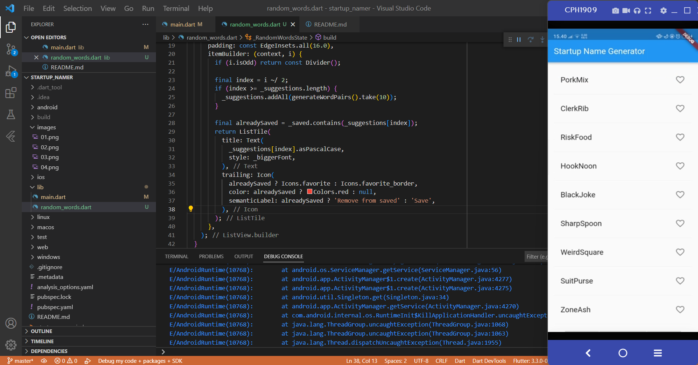
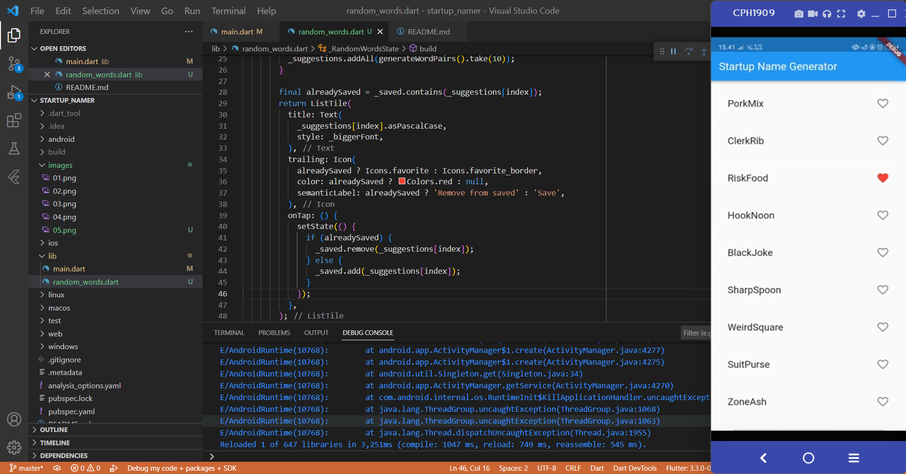
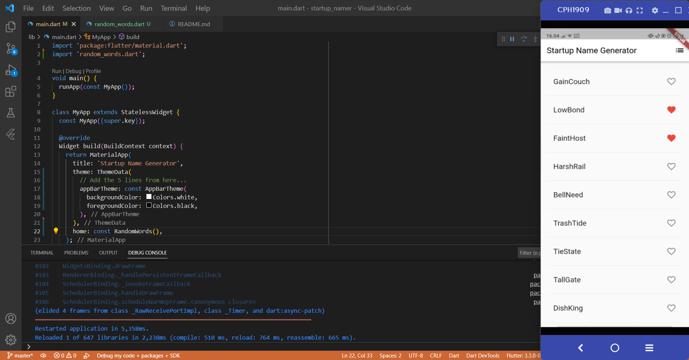

# startup_namer

Tugas hari ke 21

## Create the starter Flutter app

## Use an external package

## Add a stateful widget

## Create an infinite scrolling ListView

## Add icons to the list

## Add interactivity

## Navigate to a new screen

## Change the UI using themes
